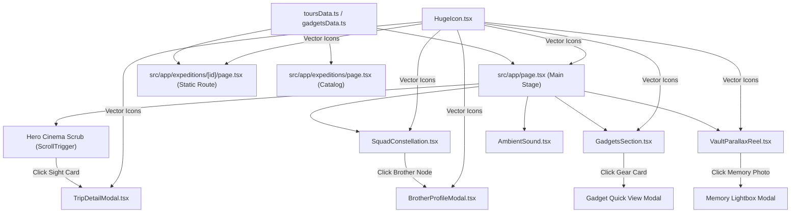

# Travel with Bhai Brothers — Architectural File Structure

This document provides a comprehensive map of the repository's file structure, directory tree, component responsibilities, asset collections, and data flow architecture.

---

## 1. Directory Tree Overview

```
travel-with-bhai-brothers/
├── .gitignore                      # Git exclusion rules
├── AGENTS.md                       # Next.js agent operational guidelines
├── CLAUDE.md                       # Project developer instructions & coding standards
├── REQUIREMENTS.md                 # Detailed feature & system requirements
├── FILE_STRUCTURE.md               # Repository map and component documentation
├── README.md                       # High-level project summary
├── next.config.ts                  # Next.js 16 configuration
├── package.json                    # Project dependencies and script runner
├── postcss.config.mjs              # PostCSS plugin pipeline
├── tsconfig.json                   # TypeScript compiler configuration (strict mode)
├── Resources/
│   └── Prompt                      # Original design specification & remote scene asset URLs
├── public/
│   ├── favicon.ico                 # Site icon
│   └── images/                     # Local high-res adventure photography
│       ├── amiakhum.jpg            # Amiakhum waterfall trail
│       ├── bandarban.jpg           # Bandarban green peaks & streams
│       ├── bogalake.jpg            # Boga Lake mystery campsite
│       ├── coxsbazar.jpg           # Cox's Bazar coastline
│       ├── hero_campfire.jpg       # Midnight brotherhood campfire
│       ├── hero_sajek_sky.jpg      # Floating morning clouds over Sajek
│       ├── kaptai.jpg              # Kaptai Lake emerald waters
│       ├── kuakata.jpg             # Kuakata coastal sunrise
│       ├── remakri.jpg             # Remakri cascade boulders
│       ├── saintmartin.jpg         # Saint Martin coral island
│       ├── sajek.jpg               # Sajek Valley mountain road
│       ├── sreemangal.jpg          # Sreemangal lush tea estates
│       ├── tanguar.jpg             # Tanguar Haor houseboat odyssey
│       └── squad/                  # Real brotherhood portrait photography
│           ├── ahnaf.jpg           # Ahnaf Habib
│           ├── ariyan.jpg          # Ariyan Khan
│           ├── asif.jpg            # Asif Iqbal
│           ├── fahim.jpg           # Fahim Zaman
│           ├── imtiaz.jpg          # Imtiaz Ahmed
│           ├── mahim.jpg           # Mahim Reza
│           ├── nabil.jpg           # Nabil Morshed
│           ├── rakib.jpg           # Rakib Hasan
│           ├── riyad.jpg           # Riyadul Hasan
│           ├── sami.jpg            # Sami
│           ├── shakil.jpg          # Shakil Chowdhury
│           ├── sourav.jpg          # Sourav Bhowmik
│           ├── tanvir.jpg          # Tanvir Ahmed
│           └── zubair.jpg          # Zubair Mahmud
└── src/
    ├── app/                        # Next.js App Router root
    │   ├── layout.tsx              # Root HTML shell, fonts, and metadata
    │   ├── page.tsx                # Main single-page interactive experience
    │   ├── globals.css             # Tailwind baseline & design variables
    │   ├── cinema.css              # Theater-curtain scroll stage & 3D transformations
    │   ├── about/                  # Brotherhood Origin & Manifesto page
    │   │   └── page.tsx            # Cinematic story, timeline, commandments & squad wall
    │   └── expeditions/            # Dedicated expeditions directory
    │       ├── page.tsx            # All-expeditions index & filter catalog
    │       └── [id]/
    │           └── page.tsx        # Dynamic SSG detail page for each expedition
    ├── components/                 # Reusable UI & animation modules
    │   ├── AmbientSound.tsx        # Atmospheric outdoor sound engine
    │   ├── BrotherProfileModal.tsx # Full-screen brother passport & attribute modal
    │   ├── EditorialTourGallery.tsx # Editorial asymmetric portfolio photo grid & lightbox
    │   ├── Footer.tsx              # Cinematic footer, credits & brother signatures
    │   ├── GadgetsSection.tsx      # Minimal Apple-grade travel gear catalog
    │   ├── HeroSection.tsx         # Standalone hero component
    │   ├── HugeIcon.tsx            # Standardized vector icon mapper (Zero Emojis)
    │   ├── InteractiveTourRoad.tsx # Horizontal highway road, moving car & milestone stepper
    │   ├── MemoryVault.tsx         # Memory vault preview reel
    │   ├── Navbar.tsx              # Floating island capsule navbar with scrollspy & sound toggle
    │   ├── SquadConstellation.tsx  # 13-node celestial sacred geometry constellation
    │   ├── TripDetailModal.tsx     # Expedition quick-view modal (from hero slider)
    │   └── VaultParallaxReel.tsx   # 32-photo parallax drifting gallery
    └── data/                       # In-memory data models & typed fixtures
        ├── gadgetsData.ts          # Adventure gear inventory & equipment specs
        └── toursData.ts            # Expeditions, brothers, costs, and timeline steps
```

---

## 2. Detailed Component Responsibilities

### 2.1 `src/components/HugeIcon.tsx`
- **Purpose**: Enforces the **Zero Raw Emojis Policy** across the entire website.
- **Exports**:
  - `BROTHER_HUGEICONS`: Mapping of all 13 brother IDs to specific Hugeicons.
  - `BrotherBadgeIcon`: Helper component taking `brotherId` and rendering the corresponding icon with custom size and styling.
  - Re-exports of commonly used Hugeicons (`Compass01Icon`, `ChefHatIcon`, `Camera01Icon`, `Moon02Icon`, `Coins01Icon`, `MusicNote03Icon`, `FlashIcon`, `FirstAidKitIcon`, `Car01Icon`, `LaughingIcon`, `BookOpen01Icon`, `TeaIcon`, `MountainIcon`, `Location01Icon`, `Calendar01Icon`, `SparklesIcon`, `Cancel01Icon`, etc.).

### 2.2 `src/components/SquadConstellation.tsx`
- **Purpose**: Interactive celestial orbital constellation displaying all 13 brothers.
- **Key Features**:
  - 1200px orbital canvas with 20 radial shimmering spokes and two concentric orbital rings (`r=240px` and `r=440px`).
  - Trigonometric placement: Inner circle (5 key roles), Outer circle (8 specialist roles).
  - GSAP animations configured with `xPercent: -50, yPercent: -50` to guarantee centered rotation without offset drift.
  - Vector badge rendering via `<BrotherBadgeIcon />`.
  - Floating cyberpunk hover HUD displaying real-time brother details.
  - Selection callback triggering `BrotherProfileModal`.

### 2.3 `src/components/BrotherProfileModal.tsx`
- **Purpose**: Detailed dossier modal for individual squad members.
- **Features**:
  - High-res portrait banner with cinematic gradient scrim.
  - Quick passport metadata: Blood group, home district, completed tours, favorite destination.
  - Official quote and background origin story.
  - Superpower & funny weakness cards.
  - Signature EDC equipment tags.
  - Attended expeditions list with navigation links.
  - Visual skill bars (Leadership, Navigation, Cooking, Humor, etc.).
  - Memorable tour blooper callout.

### 2.4 `src/components/GadgetsSection.tsx`
- **Purpose**: Minimalist, Apple-inspired expedition gear catalog.
- **Features**:
  - Replaces complex inventory management with a clean editorial presentation.
  - Category filters: All, Owned, Wishlist, Camera Gear, Camping, Survival & Power.
  - Grid of sleek gadget cards with brand, weight, price, and status indicator.
  - Detail inspection modal showing field review notes, waterproof ratings, and assigned gear guardian.

### 2.5 `src/components/VaultParallaxReel.tsx`
- **Purpose**: Fluid, 32-photograph drifting memory vault.
- **Features**:
  - Multi-tier horizontal floating reels driven by scroll velocity.
  - Interactive hover magnification and depth of field.
  - Full-screen lightbox modal with photographer credit, location tag, and caption.
  - Close button using `<HugeiconsIcon icon={Cancel01Icon} />`.

### 2.6 `src/components/TripDetailModal.tsx`
- **Purpose**: Quick-view modal triggered when clicking sight cards in the hero slider.
- **Features**:
  - Day-by-day itinerary breakdown.
  - Key trip highlights.
  - Visual photo snapshot carousel.
  - Link to the full dynamic route `/expeditions/[id]`.

### 2.7 `src/components/AmbientSound.tsx`
- **Purpose**: Atmospheric outdoor audio engine.
- **Features**:
  - Generates or plays ambient soundscape (mountain breeze, campfire embers).
  - Sticky nav controls with animated sound waves and volume slider.
  - Safe initialization respecting browser autoplay policies.

### 2.8 `src/components/InteractiveTourRoad.tsx`
- **Purpose**: Interactive horizontal road trip chronicle with moving expedition vehicle and step-by-step day transitions.
- **Features**:
  - Pinned GSAP ScrollTrigger timeline that translates page scrolling into horizontal highway road progress.
  - Asphalt roadway with glowing dashed lane lines, curb stripes, and interactive milestone checkpoints.
  - Animated 4x4 expedition vehicle with radiant headlights and suspension motion.
  - 3-stage card presentation: Active card (center spotlight), Upcoming card (preview milestone to the right), Previous card (conquered milestone to the left).
  - Seamless unpin transition into subsequent expedition sections.
  - Manual controls: Next/Prev shifter buttons, milestone direct click, and automated cruise mode.

### 2.9 `src/components/Navbar.tsx`
- **Purpose**: Ultra-premium floating island capsule navbar.
- **Features**:
  - Floating pill geometry (`fixed top-3 sm:top-5 left-1/2 -translate-x-1/2 z-50 w-[94%] max-w-6xl`).
  - Frosted glass backdrop with specular highlight, ambient shadow, and glowing compass crest.
  - Scrollspy active section tracking with glowing cyan indicator pill.
  - Integrated ambient sound widget with animated equalizer wave.
  - Mobile frosted drawer with responsive layout.

---

## 3. Application Routes (`src/app`)

| Route | File Path | Type | Description |
|---|---|---|---|
| `/` | `src/app/page.tsx` | Client Component (`"use client"`) | Main single-page interactive portal: Hero cinema scroll, expedition dock, constellation, gadgets hub, memory vault, and bucket list voting. |
| `/expeditions` | `src/app/expeditions/page.tsx` | Server Component | Full catalog of all 12 brotherhood expeditions with category filtering and stat cards. |
| `/expeditions/[id]` | `src/app/expeditions/[id]/page.tsx` | Server Component (`SSG`) | Deep expedition route: Route log timeline, transparent budget ledger, gear checklist, squad roster, and uncensored bloopers. |

---

## 4. Data Layer (`src/data`)

### 4.1 `src/data/toursData.ts`
- **Data Models**:
  - `SquadMember`: 13 brother records with ID, name, role, avatar identifier, biography, blood group, skills, and gear.
  - `TourExpedition`: 12 comprehensive expedition records with coordinates, itinerary, cost breakdown, bloopers, and gallery.
  - `JourneyStep`: Detailed milestone steps for expedition timelines.
  - `BucketItem`: Dream destinations with real-time upvoting support.

### 4.2 `src/data/gadgetsData.ts`
- **Data Models**:
  - `TravelGadget`: 12+ expedition gear items categorized into Camera, Camping, Survival, and Power with field test specs.

---

## 5. Architectural Data Flow


